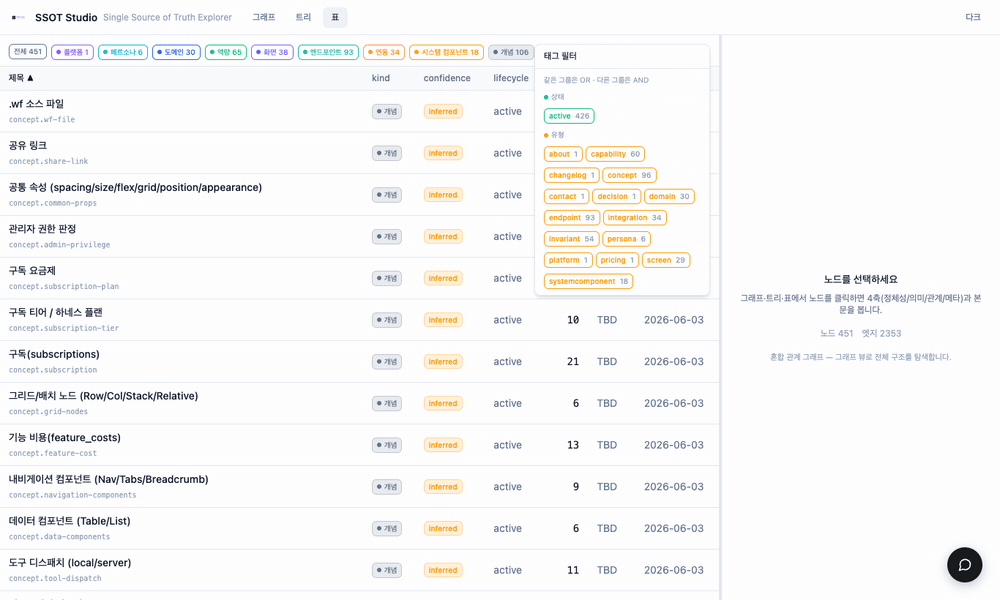

<p align="center">
  
</p>

# ssot-web

SSOT 노드를 **그래프·트리·표** 로 시각화하는 뷰어. 노드 클릭·깊이 탐색·태그 필터·드래그 리사이즈 상세 패널을 제공한다. 특정 프로젝트에 묶이지 않은 범용 뷰어로, 빌드 시 주입된 SSOT 데이터를 렌더한다.

<p align="center">
  
</p>

## 구조 (pnpm workspace)

| 위치 | 역할 |
|------|------|
| `apps/web` | 뷰어 앱 (React 19 · TanStack Router/Query · Vite) |
| `packages/ui` | 디자인 시스템 / 그래프 컴포넌트 (@xyflow, dagre) |
| `packages/cli` · `packages/daemon` | 로컬 dev watch (실시간 미리보기) |
| `vendor/` | `@ssot-studio/core` 빌드물 (`vendor-sync.mjs` 로 동기화) |

## 빌드

```bash
pnpm install
pnpm build        # apps/web → dist
```

`dist` 에 SSOT 데이터를 주입해 정적 호스팅한다. 배포 방식(클론·포크·CI 등)은 자유다.

## 로컬 실행 (여러 SSOT 동시)

데이터는 `apps/web/public/<name>` 에서 읽는다. 인스턴스마다 **데이터 소스(`VITE_SSOT_DATA`)** 와 **포트(`--port`)** 를 달리하면 여러 SSOT 를 동시에 띄울 수 있다.

```bash
# 1) 데이터 연결 — 각 SSOT 의 ssot/ 를 public/<name> 으로 (심볼릭 링크 또는 복사)
ln -s <projectA-ssot>/ssot apps/web/public/ssot-a
ln -s <projectB-ssot>/ssot apps/web/public/ssot-b

# 2) 인스턴스별 실행 — VITE_SSOT_DATA=/<name> + --port
VITE_SSOT_DATA=/ssot-a pnpm --filter web dev -- --port 5180
VITE_SSOT_DATA=/ssot-b pnpm --filter web dev -- --port 5181
```

`VITE_SSOT_DATA` 기본값은 `/ssot`(즉 `public/ssot`), 포트 기본값은 `5180`.

## org

`https://github.com/ssot-studio` — 형제: `ssot-core`(로직), `ssot-plugin`(플러그인).
